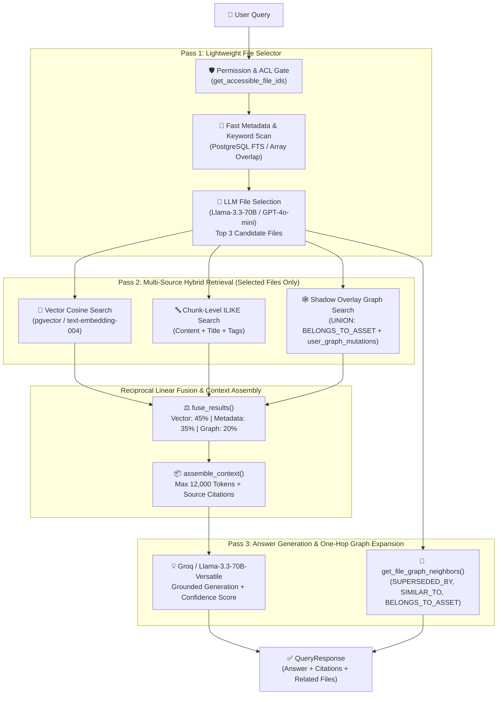
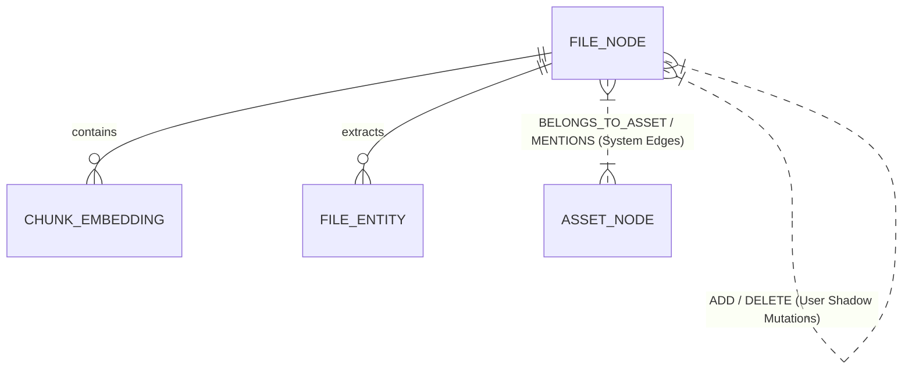

# 🚀 Industrial Hybrid GraphRAG Architecture & AI Query System

This document provides a comprehensive technical overview of the **Industrial Knowledge Intelligence Platform's** Hybrid Retrieval-Augmented Generation (RAG) architecture, the multi-view Knowledge Graph, and the AI Query & Root Cause Analysis (RCA) engine.

---

## 🏛️ System Architecture Overview

The platform uses a **Two-Pass Hybrid RAG Pipeline + One-Hop Graph Traversal** combined with level- and role-based access control (RBAC + LBAC). Every user query is strictly scoped to documents the user has explicit permission to view (`can_modify_graph`, role levels, group inheritance).

---

## 🧠 AI Models & Configuration

The AI Query and Embedding stack relies on specialized models tailored for retrieval and low-latency technical reasoning:

| Layer | Model / Service | Dimensionality / Config | Role & Purpose |
| :--- | :--- | :--- | :--- |
| **Embeddings** | `models/text-embedding-004` (Google Gemini) | `768 dimensions` (`pgvector`) | Generates dense semantic vector embeddings for document chunks and user queries (`task_type="retrieval_document"` upon ingestion, `task_type="retrieval_query"` upon search). |
| **Primary LLM** | `llama-3.3-70b-versatile` (Groq API — Free Tier) | `temperature: 0.1` `max_tokens: 1500` | High-speed, highly accurate technical answer generation strictly grounded in the assembled context. |
| **Pass 1 Selector** | `llama-3.3-70b-versatile` (or `gpt-4o-mini`) | `temperature: 0.0` `max_tokens: 200` | Evaluates compact document summaries (title, keywords, tags) and outputs a JSON array of the top 3 relevant `file_id` candidates. |
| **Audio Whisper** | `whisper-large-v3` (Groq API) | N/A | Transcribes industrial audio logs and maintenance notes into structured text chunks. |
| **Fallback LLM** | `gpt-4o` / `gpt-4o-mini` (OpenAI API) | Optional fallback | Used automatically if `GROQ_API_KEY` is unavailable. |

---

## 🔬 Detailed Retrieval Pipeline

### 1. Security & Governance Gating (`get_accessible_file_ids`)
Before any retrieval occurs, the system queries `files` and `workspace_folders` against the user's `role_level` and `role_id`.
- **Level 1 Admins**: Full access to all processed files in the workspace.
- **Level > 1 Users**: Clearance check (`min_access_level >= user_level`) combined with explicit ACL check against `allowed_role_ids` and folder inheritance (`is_inherited = true`).

### 2. Pass 1: Lightweight Metadata Scan & LLM Selection
Instead of embedding and reading thousands of heavy chunks across all files, the system executes a rapid PostgreSQL query retrieving only file-level summaries (`title`, `original_name`, `description`, `keywords`, `tags`, `file_family`).
An LLM classifier evaluates these lightweight summaries and returns the exact `UUIDs` of the top candidate documents.

### 3. Pass 2: Hybrid Retrieval & Shadow Overlay Graph Search
For the candidate files chosen in Pass 1, three parallel retrieval streams run:
- **Vector Search (`vector_search`)**: Calculates cosine similarity against `pgvector` stored chunks (`1 - (ce.embedding <=> :emb) > 0.45`).
- **Chunk Keyword Search (`metadata_search`)**: Scans exact technical terms, part numbers, and descriptions.
- **Shadow Overlay Graph Search (`graph_search`)**: Extracts industrial equipment patterns (e.g., `P-204`, `TK001`, `HX204`) from the query and performs a 3-part `UNION` query:
  1. Fetches base graph edges (`BELONGS_TO_ASSET`, `SIMILAR_TO`, `SUPERSEDED_BY`, `RELATED_TO`).
  2. Subtracts any edges marked `DELETE` by users (`UserGraphMutation` shadow overrides).
  3. Appends virtual edges marked `ADD` by users, multiplying the similarity score by the user's custom weight (`0.65 * ugm.weight`).

### 4. Reciprocal Linear Fusion (`fuse_results`)
Results across all three streams are merged by `chunk_id` / `file_id` and ranked using linear weighting:
$$\text{fused\_score} = (\text{score}_{\text{vector}} \times 0.45) + (\text{score}_{\text{metadata}} \times 0.35) + (\text{score}_{\text{graph}} \times 0.20)$$

### 5. Pass 3: Grounded Answer & One-Hop Graph Expansion
The top ranked chunks are assembled into a strict context block (`assemble_context`), ensuring the prompt stays within the `MAX_CONTEXT_TOKENS` (12,000 tokens) budget. The Groq LLM generates an answer accompanied by exact `SourceCitation` records. Simultaneously, `get_file_graph_neighbors` traverses one hop outward along system and shadow edges to surface `related_files` in the UI.

---

## 🕸️ Knowledge Graph & Human-in-the-Loop Shadow Overlay

The platform maintains a machine-generated graph enriched by real-time human expertise without mutating historical ground truth:

- **Node Types**:
  - `file`: Uploaded documents (`PDF`, `CAD`, `P&ID`, `Manuals`), color-coded by branch (`folder_name`).
  - `asset` / `entity`: Extracted industrial equipment tags (`P-204`, `V-1042A`, `TIC-301`) and key physical entities (`FileEntity`).
- **Edge Types**:
  - `SUPERSEDED_BY`: Version chain links automatically generated when a file replaces a parent document.
  - `SIMILAR_TO`: Automatic semantic similarity connections generated when chunk embedding centroids exceed `0.75` cosine similarity.
  - `BELONGS_TO_ASSET` / `MENTIONS`: Automatic connections linking documents to specific equipment tags and extracted entities.
- **Feature 1: Shadow Overlay (`user_graph_mutations`)**:
  - Authorized engineers (`can_modify_graph = True`) can draw custom links (`ADD`) or sever incorrect machine-inferred links (`DELETE`).
  - The underlying base `graph_edges` remain unmutated; retrieval and visualization queries apply the shadow mutations on the fly.

---

## 🛠️ Root Cause Analysis (RCA) Predictive Agent (`SOPRAG`)

Feature 3 implements an autonomous background agent (`analyze_anomaly_task`) triggered by telemetry anomalies:
1. **Entity Graph Query**: Traverses physical asset details and connected components (`BELONGS_TO_ASSET`).
2. **Causal Graph Query**: Retrieves historical failure logs, maintenance notes, and user-defined shadow overlay connections.
3. **Flow Graph Query**: Performs semantic vector search against regulatory compliance guidelines (`OSHA`, `ASME`).
4. **Counterfactual Reasoning**: Calls `llama-3.3-70b-versatile` with a strict structured JSON schema to generate actionable `rca_insights` (`severity_level`, `root_cause_summary`, `regulatory_violations`, `predictive_recommendation`).

---

## ✅ Summary of AI Query & Knowledge Graph Fixes Applied

To resolve issues where the Knowledge Graph and AI Query System were not functioning properly, the following root-cause architectural fixes were executed:

1. **Embedding Model Alignment (`config.py` & `tasks.py`)**:
   - Updated `GEMINI_EMBEDDING_MODEL` from `"models/gemini-embedding-001"` to `"models/text-embedding-004"`. The legacy `gemini-embedding-001` model caused API errors when invoked with `output_dimensionality=768`, resulting in zero embeddings being stored upon file upload and query-time vector search failures.
2. **Eliminated Duplicated Logic in `services/retrieval.py`**:
   - Consolidated `services/retrieval.py` by removing duplicated function definitions (`get_accessible_file_ids`, `vector_search`, `graph_search`, `assemble_context`) that were overwriting one another and causing pipeline disconnects.
3. **Unified Multi-Source Retrieval in `routers/query.py`**:
   - Upgraded `PASS 2` inside `routers/query.py` to invoke all three retrieval sources (`metadata_search`, `vector_search`, and `graph_search`) on selected files, running `fuse_results()` and passing combined chunks to `assemble_context()`. Added robust fallback to raw chunk fetching if similarity thresholds are unmet.
4. **Instant Knowledge Graph Node & Edge Creation (`_build_graph` in `tasks.py`)**:
   - Enhanced `_build_graph()` to automatically generate `asset` and `entity` nodes (`node_type="asset"` / `"entity"`) from `FileEntity` records upon file upload (`BELONGS_TO_ASSET` / `MENTIONS` edges).
   - Added immediate embedding centroid cosine similarity calculations right after file chunking to automatically create `SIMILAR_TO` edges between connected documents right away.
5. **Full Graph Rendering & Label Differentiation (`routers/graph.py` & `page.tsx`)**:
   - Updated `GET /api/v1/graph/workspace/{workspace_id}` to return `file`, `asset`, and `entity` node types alongside all system and shadow edges (`SUPERSEDED_BY`, `SIMILAR_TO`, `BELONGS_TO_ASSET`, `MENTIONS`, `RELATED_TO`).
   - Updated frontend `ForceGraph2D` (`page.tsx`) `nodeLabel` to clearly identify `ASSET` and `ENTITY` nodes dynamically when inspecting or connecting links.
