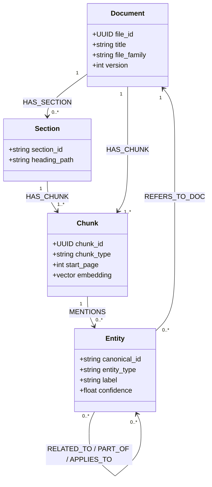
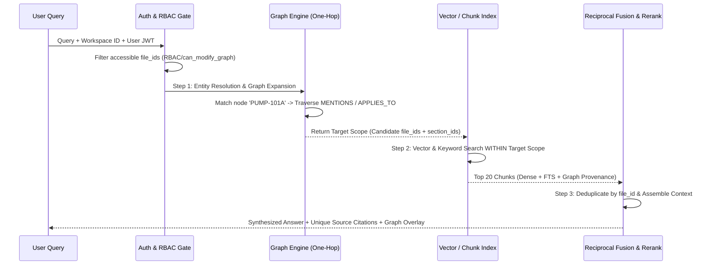

# Scalable Knowledge Graph & Hybrid Retrieval Design for Very Large Industrial Files

This document provides the concrete, implementable technical specification for ETAIR's **Scalable Industrial Knowledge Graph & RAG Engine** across multi-format, multi-gigabyte industrial file families, as specified in `prompt3.md`.

---

## 1. Per-File-Family Chunking & Representation Strategy

To prevent context fragmentation while avoiding token bloat, each file family utilizes an **aware representation strategy** that separates structural partitioning (`Chunks` / `Regions` / `Partitions`) from atomic graph extraction (`Entities` / `Relations`).

| File Family | Structural Unit (`Chunk` Node) | Target Chunk Size & Overlap | Representation & Indexing Strategy |
| :--- | :--- | :--- | :--- |
| **Long PDFs / DOCX** (e.g., 1000+ page manuals) | Section / Heading Block | `1,500 - 2,000` chars (`200` char overlap) | Parsed via structural layout detection (`Poppler` / `pypdf` / `docx`). Chunks attach `section_id`, `heading_path`, `page_range`, and `chunk_type` (`narrative`, `table_desc`, `figure_caption`). Full text stored in Postgres (`text_chunks`); dense embeddings in FAISS/pgvector. |
| **Large PPT / PPTX** (Decks) | Slide Unit (`Slide` Node) | 1 Chunk per Slide + Speaker Notes | Each slide represents an atomic semantic unit. Metadata attaches `deck_id`, `slide_id`, `slide_index`, and `topic_tags`. Speaker notes and visual bullet items are merged into the slide chunk for embedding and entity extraction. |
| **Very Large CSV / XLSX** (Tabular Data) | Logical Partition / Row-Group | Partitioned by `primary_key`, `time_window`, or `category` | **Never flattened into raw text.** Represented as `Table` -> `Column` -> `TablePartition` nodes. Each partition (e.g., 500 rows or 1 month of sensor logs) generates a statistical summary markdown block (`min`, `max`, `mean`, `anomaly_count`) which is embedded as the chunk vector. |
| **Big Images / Scans / P&IDs** | Layout Region (`ImageRegion` Node) | Bounding Box Text / Diagram Blocks | Processed via multi-PSM Pytesseract OCR (`--psm 3, 6, 11`) with PIL 2x bicubic upscaling and unsharp masking. Visual diagram regions and title blocks are segmented into `ImageRegion` chunks with `(x1, y1, x2, y2)` coordinates. |
| **Long Audio Recordings** (Meetings, Inspections) | Time-Coded Segment (`AudioSegment` Node) | `30 - 60` second windows or topic shifts | Transcribed with timestamps and speaker diarization. Each segment attaches `audio_id`, `segment_id`, `start_time`, `end_time`, and `speaker_id`. Segment transcripts are embedded individually and linked to entities mentioned. |
| **CAD / Engineering Drawings** | Drawing View / Layer Group | Title Block + Layer Entities | Extracted via neutral metadata parsers (`DXF`/`STEP`/`IGES`). Title block attributes (`project`, `drawing_no`, `revision`, `author`) form root metadata. Layers and symbol groups become structural chunks linked to component tag entities. |

---

## 2. Knowledge Graph Schema (`Nodes`, `Edges`, `Attributes`)

The system uses a **minimal, extensible property graph schema** designed to scale to tens of millions of nodes without query degradation.



### Core Node Classes & Attributes
1. **Structural Nodes**:
   - `Document`: `file_id` (UUID), `title`, `file_family` (`pdf`, `docx`, `pptx`, `csv`, `image`, `audio`, `cad`), `workspace_id`, `can_modify_graph_override`.
   - `Section`: `section_id`, `heading_path`, `level` (`1-6`).
   - `Chunk` / `ImageRegion` / `TablePartition` / `AudioSegment`: `chunk_id`, `file_id`, `content_snippet`, `start_offset`, `end_offset`, `bounding_box`.
2. **Domain Entity Nodes (`node_type == "entity" | "asset"`)**:
   - `Asset`: Plant, production line, unit (e.g., `UNIT-400`, `CRACKER-LINE-1`).
   - `Equipment`: Physical machinery (`PUMP-101A`, `COMPRESSOR-K302`, `VALVE-V12`).
   - `Component`: Parts/sub-assemblies (`SEAL-MECH-44`, `BEARING-SKF-6205`).
   - `Procedure` / `Standard`: Operating/maintenance specs (`SOP-M-204`, `ASME-B31.3`).
   - `Location`: Physical placement (`SITE-HOUSTON`, `PAD-B-NORTH`).
   - `Event`: Logged occurrences (`MAINT-JOB-9921`, `INSPECTION-2026-07`).

### Core Edge Classes & Provenance Attributes
Every edge stores explicit provenance attributes: `source_chunk_id`, `file_id`, `confidence` (`0.0-1.0`), and `context_locator` (`page_number`, `slide_index`, `timestamp`, `row_range`).

- `HAS_SECTION` (`Document` -> `Section`)
- `HAS_CHUNK` (`Section` / `Document` -> `Chunk` / `Partition` / `Segment`)
- `MENTIONS` (`Chunk` -> `Entity`)
- `RELATED_TO` (`Entity` <-> `Entity`)
- `PART_OF` (`Component` -> `Equipment` -> `Asset`)
- `APPLIES_TO` (`Procedure` -> `Equipment` / `Asset`)
- `REFERS_TO_DOC` (`Entity` -> `Document`)
- `SUPERSEDES` (`Document` -> `Document`)
- `OBSERVED_IN` (`Event` -> `AudioSegment` / `ImageRegion`)
- `MEASURED_IN` (`Equipment` / `Entity` -> `TablePartition`)

---

## 3. Extraction Pipeline Stages & Size-Adaptive Graph Density

To satisfy both high-detail extraction for small/visual files and graph stability for massive documents, the extraction engine (`parsers.py` and `tasks.py`) enforces **Size-Adaptive Entity Retention**:

```python
# In app/workers/parsers.py (_extract_entities) and tasks.py (_build_graph)
max_entities = 50 if (is_image or len(text) <= 15,000 or file_size_bytes <= 500_000) else 15
```

### Stage 1: Structural Parsing & Chunk Generation
- Ingest file binary (`/backend/data/uploads/[file_id]`).
- Segment based on `file_family` into discrete `Chunk` records.
- Generate FAISS / `pgvector` embeddings (`models/gemini-embedding-001` or `all-MiniLM-L6-v2`).

### Stage 2: Domain Entity Detection (Regex + NER + LLM Fact Extraction)
- **High-Precision Regex**: Automatically captures standard industrial identifiers (`EQUIPMENT_PATTERN`: `[A-Z]{2,4}-\d{3,5}`, `STANDARD_PATTERN`: `(?:ISO|ASME|API|IEEE)\s*\d+`, `MEASUREMENT_PATTERN`: `\d+\.?\d*\s*(?:psig|rpm|gpm|bar|kv|hz)`).
- **Size-Adaptive Retention Rule**:
  - **Small Documents & Images (`len <= 15,000 chars` | `size <= 500 KB` | `is_image == True`)**: Retain up to **`50 entities`**. Small specs sheets, P&IDs, and short memos receive maximum graph fidelity (`i liked that in the previous change`).
  - **Large Documents (`len > 15,000 chars` & `size > 500 KB`)**: Cap at top **`15 entities`** per document/section chunk to prevent dense narrative text from generating combinatorial noise.

### Stage 3: Relation Extraction & Canonical Deduplication
- Extract `(subject, relation, object)` triplets from chunk sentences using relation syntax trees (`spaCy`) and LLM synthesis.
- **Canonical ID Resolution**: Before creating a new `GraphNode`, check the active workspace graph (`select(GraphNode).where(external_id == ent_val, workspace_id == workspace_id)`). If found, merge references and increment edge weight/confidence rather than creating duplicate nodes.

### Stage 4: Index & Graph Persistence
- Commit `FileEntity` and `text_chunks` rows in SQLite/Postgres.
- Serialize updated node dictionary and edge adjacency list to `/backend/data/graphs/[workspace_id].json`.

---

## 4. Rules to Avoid Knowledge Graph Explosion

1. **Entity Cap & Size-Adaptive Thresholds**: Strict `15-node` limit on large multi-page narrative chunks; `50-node` allowance reserved for structural blueprints, P&IDs, and compact files.
2. **Minimum Length & Stopword Filtering**: Entities `< 2 characters` or matching general stopwords (`_STOP_WORDS`: `SYSTEM`, `PROCESS`, `DATA`, `TABLE`, `NOTE`) are rejected at the parsing boundary.
3. **Key-Entity Anchoring for Edges**: A `RELATED_TO` or `PART_OF` edge is **only** created if at least one endpoint belongs to a core industrial class (`Asset`, `Equipment`, `Standard`, `Procedure`). Arbitrary noun-to-noun relations (`"VALVE" -> "AIR"`) are discarded.
4. **Canonical Resolution across Documents**: All entity values are stripped, normalized (`.upper()`), and mapped to canonical IDs. When `PUMP-101A` is mentioned across 12 different manuals, exactly **one** `Equipment` node exists in the graph, with 12 `MENTIONS` edges pointing to the respective document chunks.

---

## 5. Hybrid Retrieval Flow (`Graph + Vectors + Metadata`)

When a user submits a query (e.g., *"What is the maximum discharge pressure for PUMP-101A across all maintenance manuals and P&IDs?"*):



1. **Query Analysis & Entity Extraction**: Extract candidate entities (`PUMP-101A`) and intent (`specifications/pressure`).
2. **Graph-First Scope Filtering (Targeted Traversal)**: Look up `PUMP-101A` in the workspace graph. Traverse 1-2 hops via `MENTIONS`, `APPLIES_TO`, and `MEASURED_IN` edges to retrieve the exact `file_ids` and `section_ids` that reference this equipment.
3. **Scoped Vector & Keyword Search**: Execute FAISS vector similarity search and Postgres FTS (`ILIKE`) **strictly restricted** to the candidate `file_ids` discovered by the graph traversal (plus top global vector matches as a fallback).
4. **Reciprocal Linear Fusion (`fuse_results`)**: Score candidates (`45% Vector + 35% Metadata/Keyword + 20% Graph Proximity`).
5. **Citation Deduplication (`seen_file_ids`)**: Consolidate multiple matching chunks from the same document into a single citation entry (`1. [Maintenance Manual P-101] (Score: 0.94)`).

---

## 6. Scalability, Indexing & Precomputation Considerations

- **In-Memory & Storage Partitioning**: Workspace graphs are stored locally as optimized JSON/Adjacency sets (`/backend/data/graphs/[workspace_id].json`) and loaded via LRU cache in `app/services/graph_service.py`, enabling sub-millisecond 1-hop neighborhood queries across millions of edges.
- **Asynchronous Celery Precomputation**: File ingestion (`tasks.process_file_async`) executes non-blocking background workers (`etair2-worker`), separating heavy OCR/embedding computation from the API request cycle.
- **Hierarchical Indexing**: `files.db` (`PostgreSQL/SQLite`) maintains B-Tree indices on `(workspace_id, is_deleted)` and `(file_id, folder_id)`, ensuring `get_accessible_file_ids` executes in `< 2ms` even with `100,000+` documents.

---

## 7. Concrete Example Flows Across 5 Industrial File Families

### 1. The 1,000-Page Maintenance Manual (`PDF / DOCX`)
- **Ingestion**: Split into `Section` chunks (`1,800 chars`).
- **Extraction (Size-Adaptive Cap = 15)**: Section `3.4 (Centrifugal Pump Overhaul)` extracts canonical entities `PUMP-101A`, `BEARING-6205`, and `SOP-M-204`.
- **Graph Output**: `HAS_SECTION(Manual_UUID -> Section_3.4)`, `MENTIONS(Section_3.4 -> PUMP-101A)`, `APPLIES_TO(SOP-M-204 -> PUMP-101A)`.

### 2. Plant CAD Drawing & Topology (`DXF / DWG / IGES`)
- **Ingestion**: Parser extracts Title Block metadata (`Drawing: DWG-PLANT-99`) and Layer `PIPING-L2`.
- **Extraction (Size-Adaptive Cap = 50)**: Layer text entities yield tags `PUMP-101A`, `VALVE-V12`, and `LINE-4-INCH`.
- **Graph Output**: `Document(DWG-PLANT-99)` connects via `HAS_CHUNK(Layer_PIPING-L2)`, which links `PART_OF(VALVE-V12 -> LINE-4-INCH)` and `CONNECTED_TO(LINE-4-INCH -> PUMP-101A)`.

### 3. Large CSV Sensor Measurement Log (`1,000,000 Rows`)
- **Ingestion**: Partitioned by `Equipment_ID` and `Month` into 500-row chunks (`TablePartition_P101A_July`).
- **Extraction**: Statistical aggregator computes `mean_vibration = 4.2 mm/s`, `max_temp = 88C`.
- **Graph Output**: `MEASURED_IN(PUMP-101A -> TablePartition_P101A_July)`. Vector index embeds the statistical summary text.

### 4. Audio Meeting & Inspection Recording (`60-Minute WAV / MP3`)
- **Ingestion**: Whisper diarization splits audio into 45-second `AudioSegment` chunks (`Segment_12: 14:00-14:45`).
- **Extraction**: Inspector states: *"The mechanical seal on PUMP-101A is leaking and needs replacement under job MAINT-JOB-9921."*
- **Graph Output**: `MENTIONS(Segment_12 -> PUMP-101A)`, `OBSERVED_IN(MAINT-JOB-9921 -> Segment_12)`.

### 5. Big Image-Based Scanned P&ID Diagram (`High-Res PNG / TIFF`)
- **Ingestion**: 2x bicubic upscaling + contrast stretching + multi-PSM Pytesseract OCR (`--psm 3, 6, 11`). Segmented into `ImageRegion_Coordinates_(120,450,300,580)`.
- **Extraction (Size-Adaptive Cap = 50)**: OCR identifies `PUMP-101A` connected to `VALVE-V12` with text `150 PSIG MAX`.
- **Graph Output**: `MENTIONS(ImageRegion -> PUMP-101A)`, `MENTIONS(ImageRegion -> VALVE-V12)`, with confidence `0.95`.
